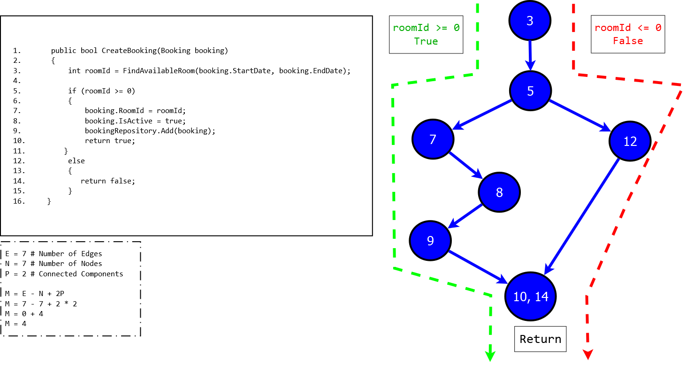
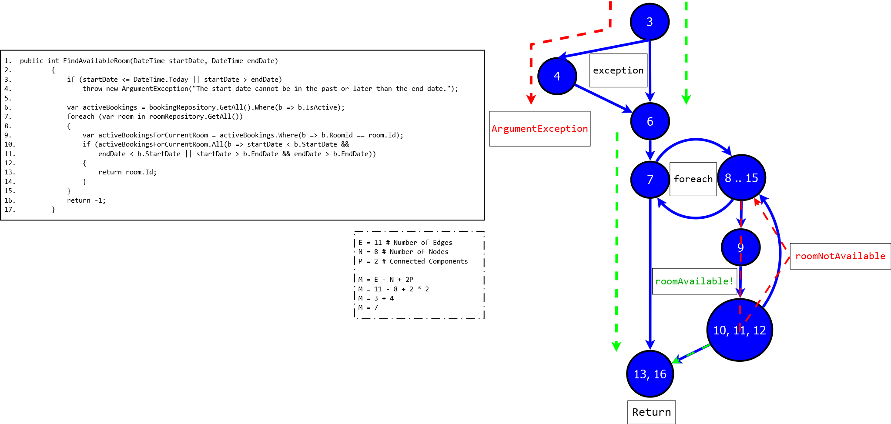

# .NETesting
HotelBookingRepositoryClean refactored, including Unit Tests, Functional Test using SpecFlow &amp; Gherkin. In addition: Architectural Design it was improved.

## Architectural Design
### Code Structure

---
```bash
└───HotelBooking_Clean                      # Solution Name
    │
    ├───HotelBooking.BusinessLogic          # Business Logic Section
    │   ├───BookingManager.cs
    │   └───IBookingManager.cs
    │
    ├───HotelBooking.Data                   # Mid-Class for Database 
    │   └───Repositories
    │        ├───BookingRepository.cs
    │        ├───CustomerRepository.cs
    │        └───RoomRepository.cs
    │
    ├───HotelBooking.Models                 # Models
    │   ├───Booking.cs
    │   ├───Customer.cs
    │   ├───Room.cs
    │   ├───IRepository.cs                  # Repository Interface 
    │   └───DateManager.cs                  # Class to Dates Manage
    │
    ├───HotelBooking.IntegrationTests       # Database Conn. Test
    │   └───BookingManagerTests.cs
    │
    ├───HotelBooking.UnitTests              # Unit Testing
    │   ├───BookingManagerTest.cs
    │   └───Fakes                          
    │
    ├───HotelBooking.ControllerTests        
    │   ├───BookingControllerTest.cs
    │   ├───CustomerControllerTest.cs
    │   └───RoomControllerTest.cs   
    │    
    ├───HotelBooking.Specs                  # Functional Testing
    │   ├───CreateBooking.feature.cs
    │   ├───FindAvailableRoom.feature.cs 
    │   ├───CreateBookingSteps.cs
    │   ├───FindAvailableRoomSteps.cs 
    │   ├───Fakes 
    │   ├───App.config                      # SpecFlow utilities
    │   └───Properties
    │       └───AssemblyInfo.cs
    │
    ├───HotelBookingStartupProject          # Main Web Project... 
    │   ├───Controllers
    │   ├───Models
    │   ├───Properties
    │   ├───Views
    │   │   ├───Bookings
    │   │   ├───Customers
    │   │   ├───Home
    │   │   ├───Rooms
    │   │   └───Shared
    │   └───wwwroot
    │       ├───css
    │       ├───images
    │       ├───js
    │       └───lib
    │           ├───bootstrap
    │           │   └───dist
    │           │       ├───css
    │           │       ├───fonts
    │           │       └───js
    │           ├───jquery
    │           │   └───dist
    │           ├───jquery-validation
    │           │   └───dist
    │           └───jquery-validation-unobtrusive
    │
    └──────────────── END ─────────────────>
```

## Report **TODO**
---
### TDD & Cyclomatic complexity
Cyclomatic complexity is a software metric, used to indicate the complexity of a program. It is a quantitative measure of the number of linearly independent paths through a program's source code. It was developed by [Thomas J. McCabe](http://www.literateprogramming.com/mccabe.pdf), Sr. in 1976.

Mathematically, the cyclomatic complexity of a structured program is defined with reference to the control flow graph of the program, a directed graph containing the basic blocks of the program, with an edge between two basic blocks if control may pass from the first to the second. The complexity M is then defined as:

**```M = E − N + 2P```**

where

**E** = the number of edges of the graph. <br>
**N** = the number of nodes of the graph. <br>
**P** = the number of connected components.

### DD-path Graph
- Program graphs 
- Node coverage
- Edge coverage
- Loop coverage

### CreateBooking Graph
***


### FindAvailable Graph
***


### Decision Table
***
| ***Conditions***        | 1<sup>st</sup> Case           | 2<sup>nd</sup> Case  | 3<sup>rd</sup> Case | 4<sup>th</sup> - 5<sup>th</sup> Case | 6<sup>th</sup> - 8<sup>th</sup> Case | 10<sup>th</sup> - 11<sup>th</sup> Case | 12<sup>th</sup> Case |
| ------------- |:-------------:|:-------------:|:-------------:|:-------------:|:-------------:|:-------------:|:-----:|
| ***SD is in***      | B | A | B | B | O | O | P |
| ***ED is in***      | B | A | A | O | O | A | - |
| ***Actions***       |   |   |   |   |   |   |   |
| ***Book Room***     | Y | Y | N | N | N | N | N |

***Legend*** <br>
SD = StartDate <br> 
SE = StartDate    

### Modified Condition / Decision Coverage (MCDC)
### Code Coverage Results
### Unit, Functional & Integration Testing Explanation
- DateManager Class

## Technologies Used
---
- [NUnit](https://github.com/nunit/nunit) - Unit Testing
- [NUnit3TestAdapter]() - In order, to show up the SpecFlow Test in the Test Explorer in VS2017. <br> 
    * **See this topic for more information:** [Tests not discovered in Visual Studio Test Explorer Window](https://github.com/techtalk/SpecFlow/issues/358)
- [xUnit](https://github.com/xunit/xunit) xUnit.net is a free, open source, community-focused unit testing tool for the .NET Framework.
- [Newtonsoft.Json](https://github.com/JamesNK/Newtonsoft.Json) Json.NET is a popular high-performance JSON framework for .NET
- [SpecRun.SpecFlow](https://specflow.org/documentation/NuGet-Integration/) - Installs SpecFlow and SpecRun
- [SpecFlow.Runner](https://specflow.org/plus/runner/) SpecFlow builds on existing unit testing frameworks like NUnit and MsTest.
- [Gherkin](https://docs.cucumber.io/gherkin/reference/) uses a set of special keywords to give structure and meaning to executable specifications.
- [OpenCover](https://github.com/OpenCover/opencover) (Windows only, i.e. Visual Studio 2017)
- [Report Generation Tool](https://github.com/danielpalme/ReportGenerator) ReportGenerator converts XML reports generated by OpenCover, dotCover, Visual Studio, NCover, Cobertura or JaCoCo into human readable reports in various formats.

  
- [AxoCover](https://marketplace.visualstudio.com/items?itemName=axodox1.AxoCover) Nice and free .Net code coverage support for Visual Studio with OpenCover.


## TREE Architectural Design v2
---

***Hotel Booking*** <br>
&nbsp;&nbsp;&nbsp;&nbsp;&nbsp;&nbsp;&nbsp;&nbsp;&nbsp;|| <br>
      &nbsp;&nbsp;&nbsp;&nbsp;&nbsp;&nbsp;&nbsp;&nbsp;&nbsp;||====== **Business Logic** <br>
      &nbsp;&nbsp;&nbsp;&nbsp;&nbsp;&nbsp;&nbsp;&nbsp;&nbsp;||====== **Data** <br>
      &nbsp;&nbsp;&nbsp;&nbsp;&nbsp;&nbsp;&nbsp;&nbsp;&nbsp;&nbsp;&nbsp;&nbsp;&nbsp;&nbsp;&nbsp;&nbsp;&nbsp;&nbsp;&nbsp;&nbsp;&nbsp;&nbsp;&nbsp;&nbsp;&nbsp;&nbsp;&nbsp;&nbsp;&nbsp;||====== **Booking** <br>
      &nbsp;&nbsp;&nbsp;&nbsp;&nbsp;&nbsp;&nbsp;&nbsp;&nbsp;&nbsp;&nbsp;&nbsp;&nbsp;&nbsp;&nbsp;&nbsp;&nbsp;&nbsp;&nbsp;&nbsp;&nbsp;&nbsp;&nbsp;&nbsp;&nbsp;&nbsp;&nbsp;&nbsp;&nbsp;||====== **Customer** <br>
      &nbsp;&nbsp;&nbsp;&nbsp;&nbsp;&nbsp;&nbsp;&nbsp;&nbsp;&nbsp;&nbsp;&nbsp;&nbsp;&nbsp;&nbsp;&nbsp;&nbsp;&nbsp;&nbsp;&nbsp;&nbsp;&nbsp;&nbsp;&nbsp;&nbsp;&nbsp;&nbsp;&nbsp;&nbsp;||====== **Room** <br>
      &nbsp;&nbsp;&nbsp;&nbsp;&nbsp;&nbsp;&nbsp;&nbsp;&nbsp;&nbsp;&nbsp;&nbsp;&nbsp;&nbsp;&nbsp;&nbsp;&nbsp;&nbsp;&nbsp;&nbsp;&nbsp;&nbsp;&nbsp;&nbsp;&nbsp;&nbsp;&nbsp;&nbsp;&nbsp;||====== **DateManager** <br>
      &nbsp;&nbsp;&nbsp;&nbsp;&nbsp;&nbsp;&nbsp;&nbsp;&nbsp;||====== **Models** <br>
      &nbsp;&nbsp;&nbsp;&nbsp;&nbsp;&nbsp;&nbsp;&nbsp;&nbsp;||====== **HotelBookingStartupProject** <br>

***Hotel Booking*** <br>
&nbsp;&nbsp;&nbsp;&nbsp;&nbsp;&nbsp;&nbsp;&nbsp;&nbsp;|| <br>
      &nbsp;&nbsp;&nbsp;&nbsp;&nbsp;&nbsp;&nbsp;&nbsp;&nbsp;||====== **Integration Tests** <br>
      &nbsp;&nbsp;&nbsp;&nbsp;&nbsp;&nbsp;&nbsp;&nbsp;&nbsp;||====== **Controller Tests** <br>
      &nbsp;&nbsp;&nbsp;&nbsp;&nbsp;&nbsp;&nbsp;&nbsp;&nbsp;||====== **Unit Tests** <br>
                    &nbsp;&nbsp;&nbsp;&nbsp;&nbsp;&nbsp;&nbsp;&nbsp;&nbsp;&nbsp;&nbsp;&nbsp;&nbsp;&nbsp;&nbsp;&nbsp;&nbsp;&nbsp;&nbsp;&nbsp;&nbsp;&nbsp;&nbsp;&nbsp;&nbsp;&nbsp;&nbsp;&nbsp;&nbsp;&nbsp;&nbsp;&nbsp;&nbsp;&nbsp;||====== **BookingManagerTest** <br>&nbsp;&nbsp;&nbsp;&nbsp;&nbsp;&nbsp;&nbsp;&nbsp;&nbsp;&nbsp;&nbsp;&nbsp;&nbsp;&nbsp;&nbsp;&nbsp;&nbsp;&nbsp;&nbsp;&nbsp;&nbsp;&nbsp;&nbsp;&nbsp;&nbsp;&nbsp;&nbsp;&nbsp;&nbsp;&nbsp;&nbsp;&nbsp;&nbsp;&nbsp;||====== **Fakes** <br>
      &nbsp;&nbsp;&nbsp;&nbsp;&nbsp;&nbsp;&nbsp;&nbsp;&nbsp;||====== **Functional Tests (Specs)** <br>
                    &nbsp;&nbsp;&nbsp;&nbsp;&nbsp;&nbsp;&nbsp;&nbsp;&nbsp;&nbsp;&nbsp;&nbsp;&nbsp;&nbsp;&nbsp;&nbsp;&nbsp;&nbsp;&nbsp;&nbsp;&nbsp;&nbsp;&nbsp;&nbsp;&nbsp;&nbsp;&nbsp;&nbsp;&nbsp;&nbsp;&nbsp;&nbsp;&nbsp;&nbsp;&nbsp;&nbsp;&nbsp;&nbsp;&nbsp;&nbsp;&nbsp;&nbsp;&nbsp;&nbsp;||====== **CreateBookingTest** <br>
                    &nbsp;&nbsp;&nbsp;&nbsp;&nbsp;&nbsp;&nbsp;&nbsp;&nbsp;&nbsp;&nbsp;&nbsp;&nbsp;&nbsp;&nbsp;&nbsp;&nbsp;&nbsp;&nbsp;&nbsp;&nbsp;&nbsp;&nbsp;&nbsp;&nbsp;&nbsp;&nbsp;&nbsp;&nbsp;&nbsp;&nbsp;&nbsp;&nbsp;&nbsp;&nbsp;&nbsp;&nbsp;&nbsp;&nbsp;&nbsp;&nbsp;&nbsp;&nbsp;&nbsp;||====== **FindAvailableRoomTest** <br>

## License

[MIT © Rafael García, Aleksandr Daškevič, Miguel Ángel.](./LICENSE)
